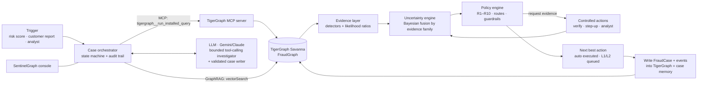

# Agentic Fraud Investigation on TigerGraph

**TigerGraph × Hacker House Goa 2026 · Task 4**

An AI agent that investigates card-fraud alerts end to end. It opens a case, gathers evidence from a TigerGraph knowledge graph through the **TigerGraph MCP server**, recalls similar past investigations with **GraphRAG** (TigerGraph vector search over closed cases, policy and regulatory guidance), works out what it knows and what it doesn't, asks for more evidence through policy-approved actions, recommends the **next best action with its approval route**, writes a SAR when policy requires one, and writes the whole case back into the graph so the next investigation can find it.

> The agent does not ask only "is this fraud?". It asks: what do I know, what don't I know, what evidence would settle it, and which action is defensible under the policy right now?

---

## Results on the 20 benchmark cases

Answer files are in [`cases/`](cases/) (one `HHG-xxx.json` per case, in the README's answer format). The full step-by-step investigation trace for each case is in [`traces/`](traces/). All 20 cases are also stored in TigerGraph as `FraudCase` vertices (`CASE-2016-00xx`) with their audit trail.

| Case | Verdict | P(fraud) | Pattern | Exposure | Connected cards | SAR | Evidence requested | Final next best action |
|---|---|---|---|---|---|---|---|---|
| HHG-001 | legitimate | 0.01 | none | $0.00 | 0 | no | none | ALLOW_TRANSACTION → GENERATE_REPORT → CLOSE_NO_FRAUD |
| HHG-002 | legitimate | 0.01 | none | $0.00 | 0 | no | step_up_auth | ALLOW_TRANSACTION → CREATE_CASE → CLOSE_NO_FRAUD |
| HHG-003 | uncertain | 0.63 | out_of_region_use | $49.00 | 0 | no | customer_validation | BLOCK_CARD → CREATE_CASE → ESCALATE_TO_ANALYST |
| HHG-004 | fraud | 0.73 | card_not_present_new_device | $128.33 | 0 | no | customer_validation | BLOCK_CARD → CREATE_CASE |
| HHG-005 | legitimate | 0.01 | none | $0.00 | 0 | no | step_up_auth | ALLOW_TRANSACTION → CREATE_CASE → CLOSE_NO_FRAUD |
| HHG-006 | fraud | 0.99 | **undocumented** (threshold structuring) | $1,906.07 | 11 | yes | none | BLOCK_CARD → CREATE_CASE → FILE_REPORT → MONITOR_CONNECTED_CARDS → ESCALATE_TO_ANALYST |
| HHG-007 | legitimate | 0.01 | none | $0.00 | 0 | no | none | ALLOW_TRANSACTION → GENERATE_REPORT → CLOSE_NO_FRAUD |
| HHG-008 | fraud | 0.99 | card_not_present_fraud | $166.97 | 1 | yes | none | BLOCK_CARD → CREATE_CASE → FILE_REPORT → MONITOR_CONNECTED_CARDS |
| HHG-009 | fraud | 0.98 | card_not_present_fraud | $30.02 | 0 | no | none | BLOCK_CARD → CREATE_CASE |
| HHG-010 | legitimate | 0.01 | none | $0.00 | 0 | no | step_up_auth | ALLOW_TRANSACTION → CREATE_CASE → CLOSE_NO_FRAUD |
| HHG-011 | fraud | 0.95 | card_not_present_new_device (shared device) | $131.30 | 5 | yes | none | BLOCK_CARD → CREATE_CASE → FILE_REPORT → MONITOR_CONNECTED_CARDS |
| HHG-012 | legitimate | 0.01 | none | $0.00 | 0 | no | none | ALLOW_TRANSACTION → GENERATE_REPORT → CLOSE_NO_FRAUD |
| HHG-013 | legitimate | 0.01 | none | $0.00 | 0 | no | step_up_auth | ALLOW_TRANSACTION → CREATE_CASE → CLOSE_NO_FRAUD |
| HHG-014 | fraud | 0.89 | **undocumented** (device-sharing ring) | $439.61 | 27 | yes | none | BLOCK_CARD → CREATE_CASE → FILE_REPORT → MONITOR_CONNECTED_CARDS → ESCALATE_TO_ANALYST |
| HHG-015 | legitimate | 0.01 | none | $0.00 | 0 | no | step_up_auth | ALLOW_TRANSACTION → CREATE_CASE → CLOSE_NO_FRAUD |
| HHG-016 | fraud | 0.99 | card_not_present_new_device (shared origin) | $59.67 | 3 | yes | none | BLOCK_CARD → CREATE_CASE → FILE_REPORT → MONITOR_CONNECTED_CARDS |
| HHG-017 | legitimate | 0.03 | none | $0.00 | 0 | no | none | ALLOW_TRANSACTION → GENERATE_REPORT → CLOSE_NO_FRAUD |
| HHG-018 | legitimate (disputed recurring charge, R7) | 0.02 | none | $0.00 | 0 | no | customer_validation | CREATE_CASE → WARN_CUSTOMER → CLOSE_NO_FRAUD |
| HHG-019 | fraud | 0.99 | card_not_present_new_device (shared device) | $99.92 | 4 | yes | none | BLOCK_CARD → CREATE_CASE → FILE_REPORT → MONITOR_CONNECTED_CARDS |
| HHG-020 | legitimate | 0.01 | none | $0.00 | 0 | no | step_up_auth | ALLOW_TRANSACTION → CREATE_CASE → CLOSE_NO_FRAUD |

`python validate_answers.py` checks every file against the answer format and the policy. It confirms that every ID exists in the dataset, that exposure equals the sum of the affected amounts, that routes match the approval table, and that `sar.file` agrees with `FILE_REPORT`.

### Proactive monitoring (beyond the 20 cases)
`monitor.py` scans November–December without any alert: it runs the device-ring scan, the structuring scan and WCC, then investigates the top findings end to end. It found 57 suspicious shared-device profiles and all 12 structuring cards, and opened 6 cases (all fraud, all reported). See [`proactive/README.md`](proactive/README.md).

### What the agent found beyond the five documented patterns
* **Threshold structuring (HHG-006).** Four online purchases in 30 minutes, each just under $500 ($456.96 to $488.04, total $1,906.07). The amounts vary, so this is not one product bought repeatedly. The agent scanned the graph and found the **same pattern on 11 other cards** in November and December, starting on the hour, and matched it to the undocumented closed cases CC-3748, CC-3841, CC-3907, CC-4086 and CC-4124.
* **Device-sharing ring (HHG-014).** One device profile (`SM-G935F Build/NRD90M | Android 7.0 | chrome 62.0 for android | 1920x1080`) behind an anonymous proxy, marked *New* on every account, used on **28 cards** between 14 November and 4 December. Case memory links it to the August wave (CC-2649, CC-2971, CC-2985, CC-3035). The WCC graph algorithm isolates it as a 28-card component.
* **Cases solved only by asking what happened on other cards.** HHG-019 involves $100 purchases from one rare device, with verizon.net → gmail.com email, on 5 cards in 4 days. In HHG-011, one Android device made $125–$131 purchases on 4 cards in 3 days. In HHG-016, Edge 16 + hotmail purchases of $59.6 appeared on 4 cards in 2 days. The card-level evidence alone is weak in each case; the graph makes it conclusive and triggers R6 (shared origin → report + monitor connected cards).

---

## Architecture



| Layer | What it does | Where |
|---|---|---|
| **Evidence graph** | Customer, Card, **Client** (latent cardholder = card + billing region + account-open day), Txn, DeviceProfile, EmailDomain, BillingRegion; `NEXT_TXN` chains per card | `graph/schema.gsql` |
| **Case memory** | 5,565 `ClosedCase` vertices (with embeddings, linked to their transactions, cards, connected cards and pattern) + every `FraudCase` the agent opens, with `CaseEvent` audit trail and `FC_SIMILAR_CC` links to the memory it used | `graph/schema.gsql`, `agent/case_store.py` |
| **Knowledge (RAG)** | Fraud policy (split per rule), the five typologies, a digest of the FinCEN/FATF/FFIEC references, lessons mined from closed cases, all as `PolicyChunk` vertices in the vector index | `knowledge/`, `agent/knowledge.py` |
| **GSQL** | 16 installed queries: transaction context, card window, behavioural baseline (GSQL accumulators), latent-client history, device fan-out, 2-hop peer transactions on other cards, case memory by customer and by device, structuring scan, device-ring scan, **WCC ring components**, vector search ×3, case timeline, stats | `graph/queries/` |
| **MCP** | Every graph read goes through the official `tigergraph-mcp` server (`tigergraph__run_installed_query`), discovered at runtime; RESTPP fallback | `agent/mcp_bridge.py`, `agent/backends.py` |
| **Evidence & uncertainty** | Detectors emit citable claims with likelihood ratios in independent families (ml, trigger, sequence, network, device, behaviour, history, customer). Fusion in log-odds, capped per family so correlated signals are not double counted. Confidence and open questions are explicit | `agent/signals.py` |
| **Case-memory model** | Gradient boosting trained on the bank's *own* closed cases (Jul–Sep), validated on October: **AUC 0.914 vs 0.866** for the bank's risk score (AP 0.44 vs 0.25). Used as the calibrated prior, never as a verdict | `prep/train_memory_model.py` |
| **Policy engine** | Fraud Policy v1.0 as code: rules R1–R10, case vs report (3a), stopping (6), approval routes, ordering, and a guard that flags breaches (R1 block on a single weak signal, R10 misuse, R7 block of a recurring dispute) | `agent/policy.py` |
| **Controlled evidence gathering** | `VERIFY_WITH_CUSTOMER`, `STEP_UP_AUTH`, analyst requests. Replies are simulated **consistently with the evidence**, and the assumption plus its basis is written into `evidence_requests` | `agent/simulator.py` |
| **LLM** | (1) a bounded investigator that may call up to N extra graph/RAG tools via function calling, and (2) the writer for summary, SAR narrative, pattern description, what changed and stop reason. **Output is validated**: text that cites an ID not in the evidence is rejected and a deterministic template is used instead. The LLM never sets probabilities or actions | `agent/llm.py`, `agent/orchestrator.py` |
| **UI** | SentinelGraph console. Investigate opens on the incoming alert; a live run streams every MCP/RESTPP tool call, then shows what happened / what the agent found / how certain / what next, the next best action with its approval route and governance, evidence sufficiency and why it stopped, decision evolution, the investigation graph, evidence → assessment → decision, and a comparison with the previous run. Case Portfolio opens saved investigations. Also: Alert Queue (incl. proactive alerts), Investigation Graph, Fraud Patterns, Case Memory (vector search), Policies (GraphRAG), Agent Activity, Audit Log. Approvals are written to the case audit trail in TigerGraph | `ui/` |

### Why these design choices
* **Graph first, LLM second.** Fraud patterns are relational: the same device on 28 cards, the same just-under-$500 burst on 12 cards. GSQL finds them deterministically and fast. The LLM is used where it adds value (probing open questions, writing) and is fenced in by validation.
* **The bank's history is the ground truth, so we learn from it.** Case memory is used four ways: as training data for the calibrated prior, as retrieval (vector + graph adjacency: same card, same device, connected card), as priors about triggers (every one of the 900 score-only alerts in memory was cleared, while every customer report was confirmed), and as pattern labels (a device already on *undocumented* closed cases makes a new case undocumented, not a forced fit).
* **Latent cardholders.** A dataset "customer" is an issuer code that aggregates many people (one card has 2,788 transactions across dozens of regions). Region and recurring-charge reasoning at card level is noise. The `Client` vertex fixes this and is the unit of behavioural evidence.
* **Uncertainty is first-class.** Every case records prior, posterior, per-family contributions, the independent lines of evidence for and against, and the open questions. Policy section 6 (stop at ≥0.85 or ≤0.15 with two independent lines of evidence) is implemented literally.

---

## Quick start

```bash
pip install -r requirements.txt
cp .env.example .env        # TG_HOST, TG_SECRET, TG_GRAPH, GEMINI_API_KEY (or ANTHROPIC_API_KEY)

# 1) data (once): derive cards, device profiles, latent clients; optional: retrain the memory model
python -m prep.train_memory_model --raw /path/to/HHGOA_IEEE     # optional, ~6 min, 6 GB RAM
python -m prep.prepare_data       --raw /path/to/HHGOA_IEEE

# 2) TigerGraph: schema + vectors + data + case memory + knowledge + 16 queries (~8 min on Savanna)
python -m graph.setup_graph

# 3) run the agent on the 20 cases -> cases/*.json, traces/*.json, FraudCase vertices in the graph
python run_cases.py
python validate_answers.py

# 4) SentinelGraph console (http://localhost:8501)
python -m streamlit run ui/app.py

# 5) proactive monitoring beyond the 20 cases (optional) -> proactive/
python monitor.py --investigate 6
```

`GRAPH_BACKEND=local` runs the same agent against an in-memory pandas mirror of the GSQL queries (used for offline development and as a reference implementation); `--no-llm` runs without an LLM.

## Repository layout
```
agent/          orchestrator, evidence detectors, policy engine, simulator, LLM, MCP bridge, backends, case store
graph/          schema.gsql, vector schema, queries/*.gsql, setup_graph.py (loader + installer)
prep/           prepare_data.py (card ids, device profiles, latent clients), train_memory_model.py
knowledge/      policy, typologies, regulatory digest, memory lessons (GraphRAG corpus)
cases/          the 20 answer files            traces/   full investigation traces
proactive/      alerts + investigations found by monitor.py (beyond the benchmark)
ui/             SentinelGraph console          docs/     blog post, demo script, social post
```

## Honest notes
* Customer, step-up and analyst replies are not provided in this round. The agent simulates them from the evidence it has (never from hidden labels) and states each assumption in `evidence_requests`.
* The memory model is trained only on the provided closed cases. No original IEEE-CIS/Kaggle files are used.
* Card IDs are derived exactly (100% match on all closed cases and the case pack) by ranking each customer's `card6` values.
# HH_GOA_Task_4

